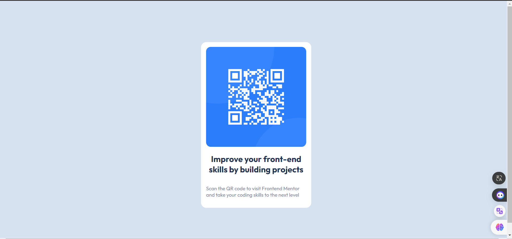

# Frontend Mentor - QR code component solution

This is a solution to the [QR code component challenge on Frontend Mentor](https://www.frontendmentor.io/challenges/qr-code-component-iux_sIO_H). Frontend Mentor challenges help you improve your coding skills by building realistic projects. 

## Table of contents

- [Frontend Mentor - QR code component solution](#frontend-mentor---qr-code-component-solution)
  - [Table of contents](#table-of-contents)
  - [Overview](#overview)
    - [Screenshot](#screenshot)
    - [Links](#links)
  - [My process](#my-process)
    - [Built with](#built-with)
    - [What I learned](#what-i-learned)
    - [Continued development](#continued-development)
    - [Useful resources](#useful-resources)
  - [Author](#author)

## Overview
This project was made with the intention of make a practice about divs, how to center them and how to give styles to many classes at the same time.
### Screenshot



### Links

- Solution URL: [https://github.com/EkoNdongAyecaba/qr-code-front-ent](https://your-solution-url.com)
- Live Site URL: [https://ekondongayecaba.github.io/qr-code-front-ent/](https://your-live-site-url.com)

## My process
The first thing i did was to create a new html file, i took all the information in the file who was came with the project, and then i begun to write css styles, and formatting it.
### Built with

- Semantic HTML5 markup
- CSS custom properties
- Flexbox
- CSS Grid
- Mobile-first workflow

### What I learned

How to add fav-icons
```html
 <link
      rel="icon"
      type="image/png"
      sizes="32x32"
      href="./images/favicon-32x32.png"
    />
```
How to center a div
```css
body{
    width: 100%;
    height: 100vh;
    display: flex;
    align-items: center;
    justify-content: center;
}
```


### Continued development

I want to learn more deeply in the way to center divs with flexbox

### Useful resources

- [The Odin Project](https://www.theodinproject.com) - This helped me for uploading and understand the project

## Author

- Frontend Mentor - [@EkoNdongAyecaba](https://www.frontendmentor.io/profile/EkoNdongAyecaba)
- Twitter - [@Shiitake_EGBM](https://www.twitter.com/Shiitake_EGBM)

